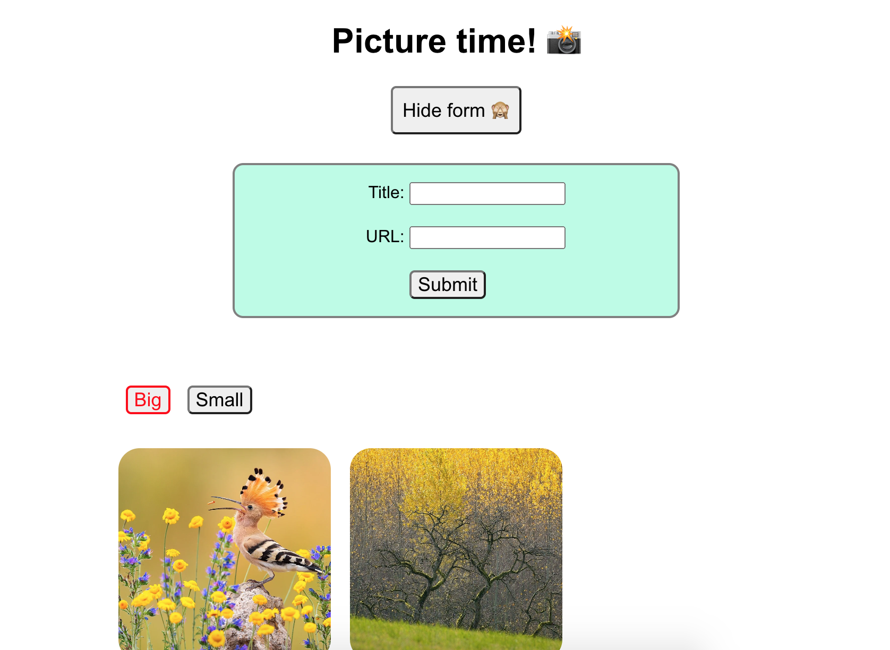
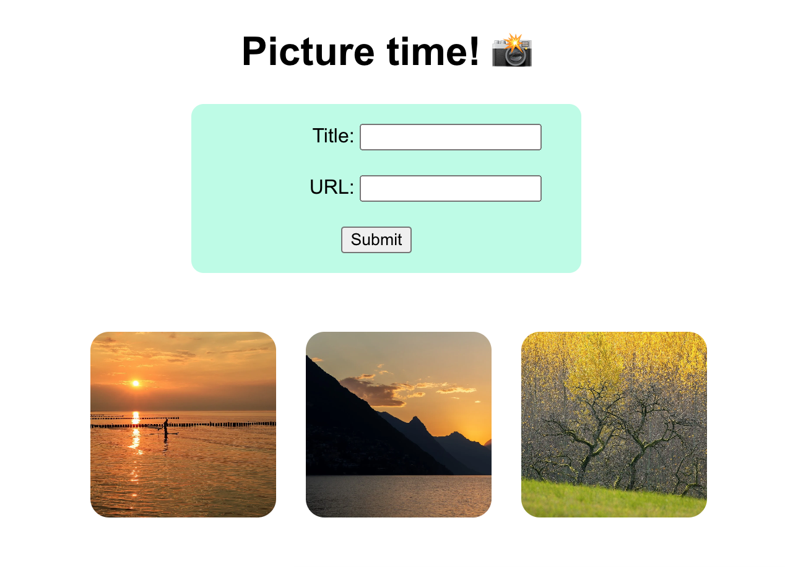

# React practice

## Project Setup

```sh
npm install
```

### Compile and Hot-Reload for Development

```sh
npm run dev
```

## Objective

Review and practice basic React concepts, including:

- Components & structure
- Data binding & state
  - Spread operators
- Passing props (parent -> child only)
  - incl. prop destructuring
- Conditional rendering
- Conditional styling

We will do this by creating a simple form to display images from URLs, and to be able to make those images larger or smaller by clicking buttons.


## Tasks

### Step 1: Create a form

_Concepts: components & structure_

In App.jsx, create a simple form with two text input fields and a submit button.

- A text `input` field labeled "Title".
- A text `input` field labeled "URL".
- Each input tag should have a `name` attribute.
- A "Submit" button.
- Style it as you like.


### Step 2: Add functionality

_Data binding, click events, useState(), spread operators_

Add functionality to your "Submit" button - when you click it, it should save your form input (an image URL & title), to state.

- Create 2 pieces of state:
  - `form`, initialized to an empty form `{title: '', url: ''}`
  - `images`, initialized as an empty array.
- Bind your form inputs to your `form` state. (In Vue, we can just do this with v-model, but in React we need 2 steps):
  - Add a `value` to each input element, and assign it to the appropriate value in your `form` state (i.e. `form.title` or `form.url`). Try to type in your form. And in your empty `form` fields in your code. What happens? Why?
  - Add an `onChange` event listener to each input, which updates your `form` state each time an input field is changed. You can look at your React portfolio code from class as an example.
- On button click, add the form input into your "images array".
  - Hint: Instead of using `.push()`, you'll need to use `setImages` to update your `images` state.
    

### Step 3: Display your images

_Components, prop passing, prop destructuring_
Render all of your saved images in your image grid.

- Pass your `images` to your `<ImageGrid />` component as a prop.
  - Remember to also receive props in the child component, in the argument of your function.
- Using `.map()`, loop through your "images" data, and create an `` tag for each one.
- Add some styling so that your images are a manageable size, arranged in a grid, evenly spaced and centered.
- When you add a new image with your "Submit" button, it should appear automatically in your grid.



### Step 4: Conditional styling

_Concepts: Components, event listeners, useState_

In your `ImageGrid`, create buttons that say "big" and "small".
Clicking the "big" button should make the size of your images bigger. Clicking "small" should return them to their original size.
Whichever size is "active" should be clear in the button styling. i.e. If your images are bigger, the "big" button should be highlighted somehow. If the images are small, the "small" button should be highlighted to show that this is the active state.

- Create state called `isBig` and initialize it to false.
- Create and import an `ImageGrid.css` file.
- There, create a class `.active`, and add some styling that will highlight the active button.
- Add conditional classes to your buttons. If `isBig` is true, the "Big" button should be `.active`. If isBig is false, "small" should be `.active`.
- Add basic functionality with `onClick` event listeners to update your `isBig` state: clicking "Small" should set `isBig` to false, and clicking `Big` should set it to true.
- In your `ImageGrid.css file` section, create a new `img` class `.big`, with a larger image size.
- Add a conditional class to your `` tags: if "isBig" is true, it should have the `.big` class and should appear larger.

Small:


Big:


### Step 5: Conditional rendering

_Concepts: event listeners, useState, JSX_

Finally, let's use conditional rendering to hide or show our input form. Instead we should show a button saying "Add images!". Clicking the button should show the form.

- In App.jsx, create a button "Add images!"
- Create state `showForm` and initialize it to "false"
- Using Javascript, add a conditional around your `<form>`, so it only renders (aka displays) if `showForm` is true. Your form should disappear.
- Add a click handler to your "Add images!" button, so it toggles `showForm` between true & false. Now your form should disappear and reappear when you click the button.

Finally, let's clarify our button text: when the form is hidden, the button should say "Add images!" But when the form is showing, let's change the button text to "Hide form"

- Add a ternary expression around your button text: if your `showForm` is true, the button should read "Hide form". If `showForm` is false, it should say "Add images!"

Hidden form:


With form:

